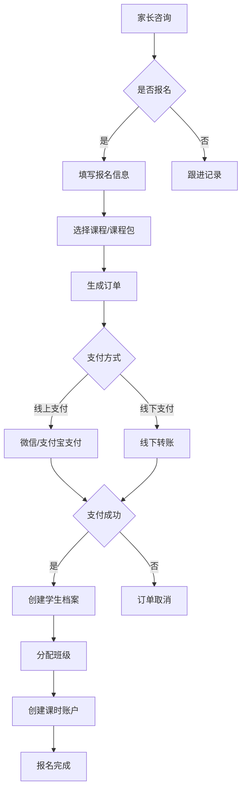
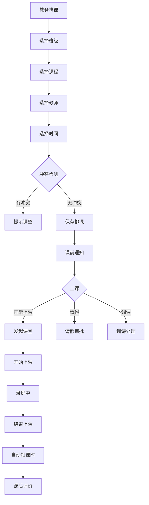
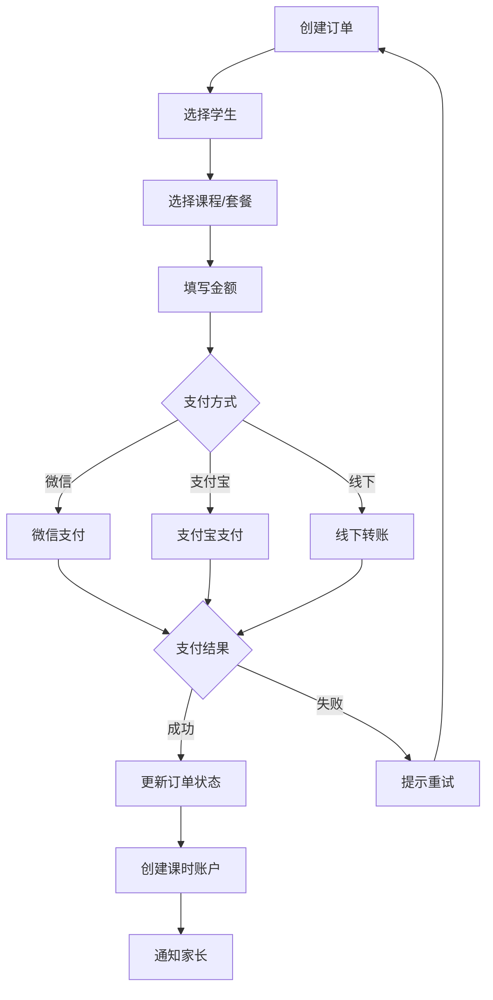
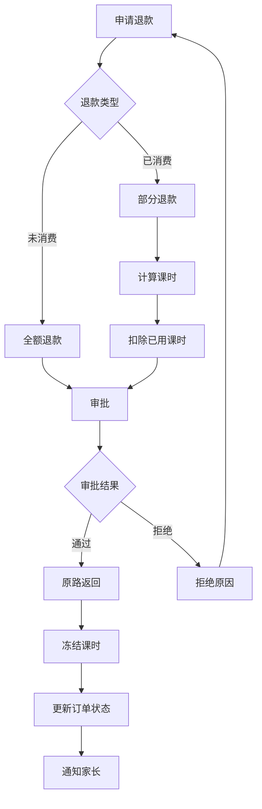
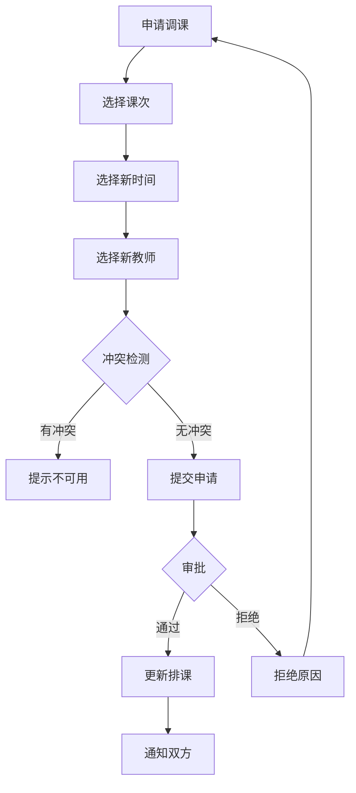
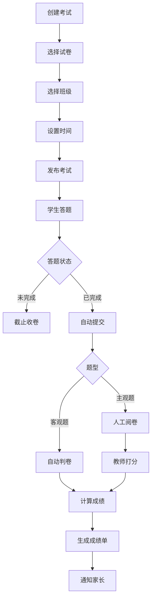

# 业务流程图

## 1. 招生报名流程

## 2. 排课上课流程

## 3. 订单支付流程

## 4. 退款流程

## 5. 调课补课流程

## 6. 考试流程

## 7. 课时扣减规则

| 场景 | 扣课时 | 说明 |
|------|--------|------|
| 正常上课 | 1课时 | 课程结束后自动扣减 |
| 请假(24h前) | 0课时 | 需提前24h请假 |
| 请假(24h内) | 0.5课时 | 视为迟到扣课 |
| 迟到(>15min) | 1课时 | 超过15分钟按旷课 |
| 早退(<30min) | 0课时 | 不足30分钟不扣 |
| 早退(>30min) | 1课时 | 超过30分钟按旷课 |
| 旷课 | 1课时 | 未请假且未上课 |

## 8. 角色权限矩阵

| 功能模块 | 超级管理员 | 教务管理员 | 教师 | 学生 | 财务 |
|----------|-------------|------------|------|------|------|
| 用户管理 | √ | × | × | × | × |
| 角色权限 | √ | × | × | × | × |
| 学生管理 | √ | √ | × | × | × |
| 教师管理 | √ | √ | × | × | × |
| 课程管理 | √ | √ | × | × | × |
| 班级管理 | √ | √ | × | × | × |
| 排课管理 | √ | √ | √ | × | × |
| 在线课堂 | √ | √ | √ | √ | × |
| 录屏回放 | √ | √ | √ | √ | × |
| 课时管理 | √ | √ | √ | √ | × |
| 订单管理 | √ | √ | × | × | √ |
| 退款管理 | √ | × | × | × | √ |
| 统计分析 | √ | √ | √ | √ | √ |