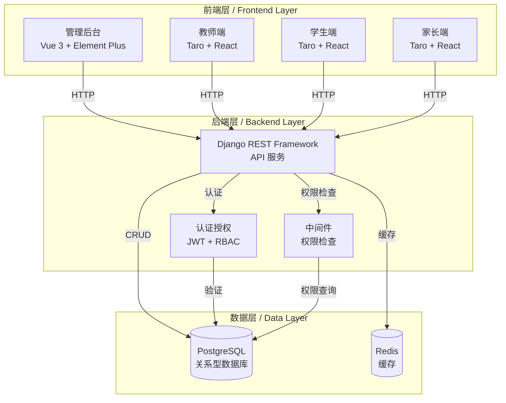
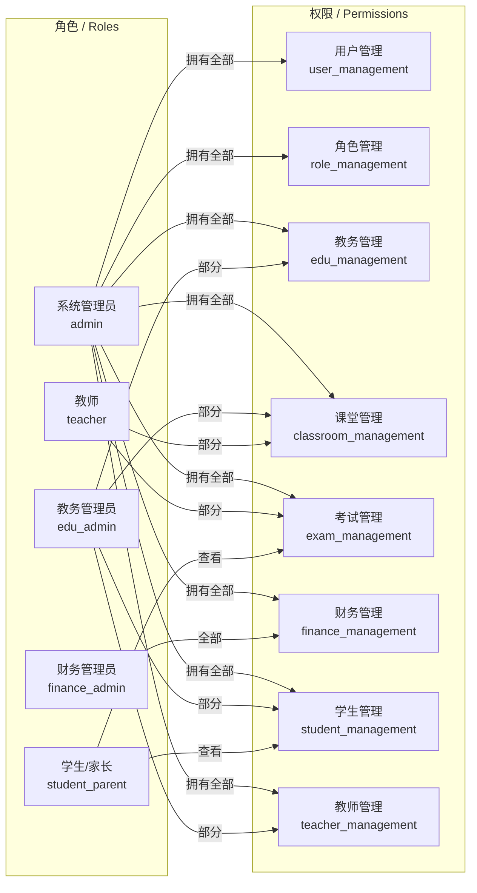

# OPENEXAM Education Management System

## 系统简介 / System Overview

OPENEXAM 是一个面向教务运营、在线课堂、考试与财务联动的多角色教育业务平台。系统采用前后端分离架构，支持完整的教育业务流程管理。

OPENEXAM is a multi-role educational business platform for educational administration, online classrooms, examinations, and financial management. The system adopts a front-end and back-end separation architecture, supporting complete educational business process management.

## 系统架构 / System Architecture

### 整体架构图 / Overall Architecture



### 权限架构图 / Permission Architecture



## 功能模块 / Feature Modules

### 1. 用户管理 / User Management
- 用户注册、登录、密码重置
- 角色分配与权限管理
- 用户信息维护
- 操作日志记录

### 2. 教务管理 / Educational Management
- 班级管理
- 课程管理
- 教师管理
- 学生管理
- 课程表管理

### 3. 课堂管理 / Classroom Management
- 在线课堂
- 课程录制
- 课堂互动

### 4. 考试管理 / Examination Management
- 试卷管理
- 题库管理
- 考试安排
- 成绩管理

### 5. 财务管理 / Financial Management
- 订单管理
- 退款管理
- 收支统计

## 技术栈 / Technology Stack

### 后端 / Backend
- Python 3.12
- Django 4.2+
- Django REST Framework 3.14+
- PostgreSQL 14
- Redis 7
- Gunicorn

### 前端 / Frontend
- 管理后台：Vue 3 + Vite + Element Plus
- 教师端：Taro + React
- 学生端：Taro + React
- 家长端：Taro + React

## 项目结构 / Project Structure

```
├── 01_需求文档/          # Requirements documentation
├── 02_产品设计调研/      # Product design research
├── 03_前端开发/          # Frontend development
│   ├── 01_管理后台/      # Admin backend
│   ├── 02_教师端/        # Teacher portal
│   ├── 03_学生端/        # Student portal
│   └── 04_家长端/        # Parent portal
├── 04_后端开发/          # Backend development
│   └── 03_业务代码/      # Business code
│       ├── users/        # User management module
│       ├── edu/          # Educational management module
│       ├── classroom/    # Classroom management module
│       ├── exam/         # Examination management module
│       └── finance/      # Financial management module
├── 05_数据库设计/        # Database design
├── 06_测试验收/          # Testing and acceptance
├── 07_运维部署/          # Operations and deployment
├── 08_管理监工/          # Project management
└── 09_用户手册/          # User manuals
```

## 快速开始 / Quick Start

### Docker 部署 / Docker Deployment

在项目根目录执行：

Execute in the project root directory:

```bash
docker-compose up -d
```

### 本地开发 / Local Development

#### 后端 / Backend

```bash
cd 04_后端开发/03_业务代码
python -m venv venv
venv\Scripts\activate
pip install -r requirements.txt
python manage.py migrate
python manage.py init_subjects
python manage.py init_admin
python manage.py init_demo_users
python manage.py init_permissions  # 初始化权限系统
python manage.py runserver 8000
```

#### 前端 / Frontend

管理后台 / Admin Backend:

```bash
cd 03_前端开发/01_管理后台
npm install
npm run dev
```

教师端 / Teacher Portal:

```bash
cd 03_前端开发/02_教师端
npm install
npm run dev:h5
```

学生端 / Student Portal:

```bash
cd 03_前端开发/03_学生端
npm install
npm run dev:h5
```

家长端 / Parent Portal:

```bash
cd 03_前端开发/04_家长端
npm install
npm run dev:h5
```

## 访问地址 / Access Addresses

- 管理后台：`http://127.0.0.1:3000`
- 教师端：`http://127.0.0.1:3001`
- 学生端：`http://127.0.0.1:3002`
- 家长端：`http://127.0.0.1:3003`
- 后端 API：`http://127.0.0.1:8000`

## 系统截图 / System Screenshots

### 登录界面 / Login Interface

#### 管理后台登录 / Admin Backend Login


#### 教师端登录 / Teacher Portal Login


#### 学生端登录 / Student Portal Login


#### 家长端登录 / Parent Portal Login


### 管理界面 / Management Interface

#### 管理后台仪表盘 / Admin Dashboard


#### 角色管理 / Role Management


### 教师端界面 / Teacher Portal Interface


### 学生端界面 / Student Portal Interface


### 家长端界面 / Parent Portal Interface


## 默认账号 / Default Accounts

- 管理后台：`admin / admin123`
- 教师端：`teacher / teacher123`
- 学生端：`13800000002 / student123`
- 家长端：`13800000003 / parent123`

## 权限系统 / Permission System

### 角色定义 / Role Definitions

1. **系统管理员 (admin)**
   - 拥有系统所有权限
   - 负责系统配置和用户管理

2. **教务管理员 (edu_admin)**
   - 负责教务管理工作
   - 权限：用户管理、角色管理、教务管理、课堂管理、学生管理、教师管理

3. **教师 (teacher)**
   - 负责教学工作
   - 权限：课堂管理、考试管理

4. **学生/家长 (student_parent)**
   - 查看学生相关信息
   - 权限：学生管理（查看）、考试管理（查看）

5. **财务管理员 (finance_admin)**
   - 负责财务管理工作
   - 权限：财务管理

### 权限列表 / Permission List

| 权限代码 | 权限名称 | 描述 |
|---------|---------|------|
| user_management | 用户管理 | 管理系统用户 |
| role_management | 角色管理 | 管理系统角色和权限 |
| edu_management | 教务管理 | 管理教务相关信息 |
| classroom_management | 课堂管理 | 管理课堂和课程 |
| exam_management | 考试管理 | 管理考试和成绩 |
| finance_management | 财务管理 | 管理财务相关信息 |
| student_management | 学生管理 | 管理学生信息 |
| teacher_management | 教师管理 | 管理教师信息 |
| menu_management | 菜单管理 | 管理系统菜单 |
| log_management | 日志管理 | 查看系统日志 |
| notification_management | 通知管理 | 管理系统通知 |
| subject_management | 学科管理 | 管理学科信息 |
| grade_management | 年级管理 | 管理年级信息 |
| class_management | 班级管理 | 管理班级信息 |
| course_management | 课程管理 | 管理课程信息 |
| schedule_management | 课程表管理 | 管理课程表 |
| score_management | 成绩管理 | 管理学生成绩 |
| order_management | 订单管理 | 管理财务订单 |

## API 文档 / API Documentation

API 接口文档位于：`03_前端开发/05_接口文档/API接口文档.md`

API documentation is available at: `03_前端开发/05_接口文档/API接口文档.md`

## 环境变量配置 / Environment Variables

### 邮箱配置 / Email Configuration

```bash
EMAIL_HOST=smtp.qq.com
EMAIL_PORT=587
EMAIL_HOST_USER=your-email@example.com
EMAIL_HOST_PASSWORD=your-app-password
EMAIL_USE_TLS=True
DEFAULT_FROM_EMAIL=your-email@example.com
```

### JWT 配置 / JWT Configuration

```bash
JWT_SECRET_KEY=your-secret-key
SECRET_KEY=your-django-secret-key
```

## 监控与部署 / Monitoring and Deployment

- 系统支持 Prometheus 监控，配置文件：`prometheus.yml`
- 部署文档：`部署指南.md`
- 启动验证报告：`06_测试验收/05_验收报告/启动验证报告.md`

The system supports Prometheus monitoring, configuration file: `prometheus.yml`
Deployment documentation: `部署指南.md`
Startup verification report: `06_测试验收/05_验收报告/启动验证报告.md`

## 贡献指南 / Contribution Guide

1. Fork 项目仓库
2. 创建功能分支
3. 提交代码
4. 运行测试
5. 提交 Pull Request

1. Fork the repository
2. Create a feature branch
3. Commit your changes
4. Run tests
5. Submit a Pull Request

## 许可证 / License

MIT License

## 联系方式 / Contact

- 项目地址：https://github.com/dongqinghuai1/openexam
- 问题反馈：https://github.com/dongqinghuai1/openexam/issues

- Project URL: https://github.com/dongqinghuai1/openexam
- Issue tracker: https://github.com/dongqinghuai1/openexam/issues
